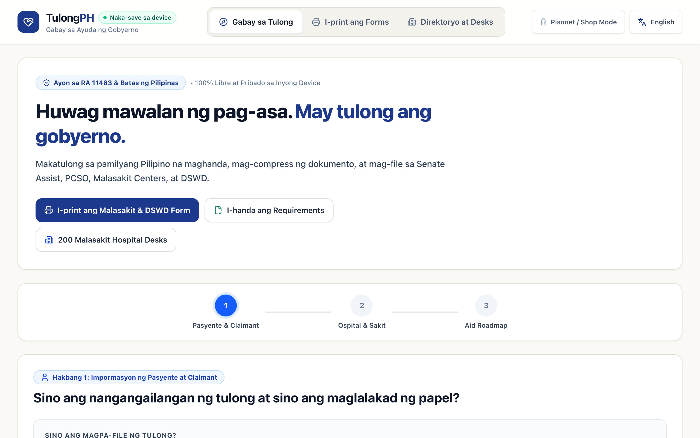
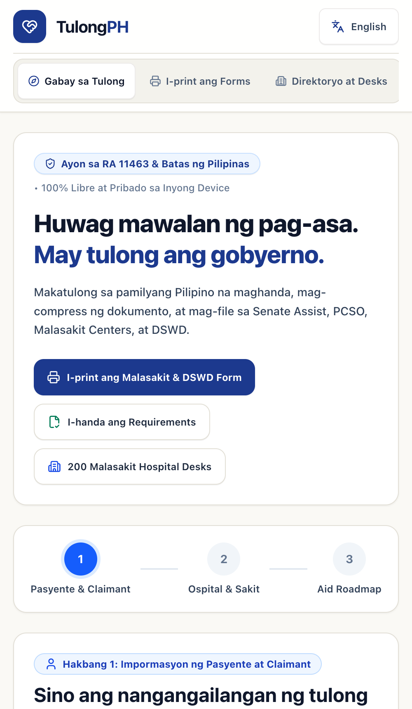

# TulongPH 🇵🇭
### Philippine Government Medical & Crisis Assistance Navigator

[](https://tulongph.vercel.app)
[](LICENSE)
[](https://nextjs.org/)
[](https://tulongph.vercel.app)

> **"Huwag mawalan ng pag-asa. May tulong ang gobyerno."**  
> *Never face a medical crisis alone. Government aid is available.*

**TulongPH** is a 100% free, offline-ready civic web application designed to guide distressed Filipino families through the bureaucratic maze of Philippine government healthcare assistance (Malasakit Centers, PCSO MAP, DSWD AICS, and Senate Medical Assistance).

---

## 📸 Screenshots

| Desktop Experience | Mobile PWA View |
| :---: | :---: |
|  |  |

---

## 🌟 Key Features

### 1. 🧭 Aid Stacking Roadmap & Intake Wizard
- **Step-by-Step Triage**: Guides applicants or representative family members through medical case details, diagnosis, and billing breakdown.
- **Aid Stacking Optimization**: Automatically calculates deduction order:
  $$\text{Total Bill} \rightarrow \text{PhilHealth Case Rate} \rightarrow \text{PCSO MAP} \rightarrow \text{Malasakit (MAIP)} \rightarrow \text{DSWD AICS}$$
- **Hospital Autocomplete**: Live search across 200 public hospitals with classification detection (DOH Retained vs. LGU).

### 2. 🖨️ Printable Official Forms & PDF Packet Generator
- **Print-Ready Documents**: Generates pixel-accurate, pre-filled official forms ready for submission to hospital Medical Social Workers:
  - **Malasakit Center Unified Intake Sheet** (RA 11463)
  - **DSWD AICS General Intake Sheet**
  - **Hospital Social Service Requirements Checklist**
- **Computer Shop / Pisonet Optimized**: High-contrast black & white layout designed for budget thermal, laser, or inkjet printers without wasting ink.
- **Embedded Document Vault**: Client-side document compressor ensuring uploads stay strictly compliant under the $2\text{MB}$ portal limit.

### 3. 🏥 Nationwide 200+ Malasakit Hospital Directory
- **Comprehensive Coverage**: 200 verified public hospitals across all 17 administrative regions (NCR, CAR, Region I to XIII, and BARMM).
- **In-Situ Desk Matching**: Automatically links the patient's admitted hospital to its exact on-site Malasakit Center desk with operating hours, verified phone numbers, and location details.
- **Dialable Hotlines**: Clean phone utility handling extensions, landlines, and crisis hotlines (8888, 911, 1343).

### 4. 🛡️ 100% Client-Side Privacy & Pisonet Mode
- **Zero Server Uploads**: Patient names, diagnoses, PhilHealth PINs, and documents remain 100% stored in local browser storage (`IndexedDB` / `localStorage`).
- **Pisonet / Public Computer Shop Mode**: 1-click total privacy wipe (`clearAllUserData()`) with confirmation modal to prevent the next computer shop user from viewing sensitive patient data.

### 5. 📲 Native Web Share & PWA
- **1-Tap Share**: Direct sharing of required document checklists and generated PDFs to Viber, Messenger, WhatsApp, or SMS.
- **Installable PWA**: Add to Home Screen on Android and iOS with offline caching.

---

## 🛠️ Tech Stack & Architecture

- **Framework**: [Next.js 16](https://nextjs.org) (App Router, Turbopack)
- **Styling**: [Tailwind CSS v4](https://tailwindcss.com) with Civic Editorial typography & color tokens
- **PDF Engine**: [jsPDF](https://github.com/parallax/jsPDF) (100% client-side rendering)
- **Image Compression**: [browser-image-compression](https://github.com/Donaldcwl/browser-image-compression)
- **Icons**: [Lucide React](https://lucide.dev)
- **Deployment**: [Vercel Edge Network](https://vercel.com)

---

## 🚀 Getting Started

### Prerequisites
- Node.js 20+
- [pnpm](https://pnpm.io/) (`npm i -g pnpm`)

### Installation & Local Run

```bash
# Clone the repository
git clone https://github.com/mark-ai-0420/tulong-ph.git
cd tulong-ph

# Install dependencies
pnpm install

# Start development server
pnpm dev
```

Open [http://localhost:3000](http://localhost:3000) in your browser.

### Quality Checks & Build

```bash
# Type check
pnpm tsc --noEmit

# Production build
pnpm build
```

---

## 📄 Civic Notice & Legal Disclaimer

*TulongPH is an independent, open-source civic utility. It is not an official Philippine government agency portal. Government medical assistance from DOH, PCSO, DSWD, and Malasakit Centers is 100% FREE. Never pay fixers or third parties for public aid.*

---

## 📜 License

Distributed under the [MIT License](LICENSE).
